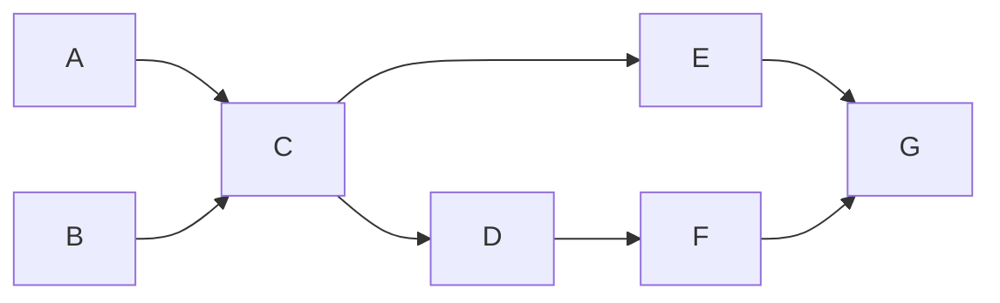

[toc]

# 环检测 & 拓扑排序

在看本文之间，最好先去了解 [图的遍历](./图的遍历.html)

对于**<font color='red'>无环图的遍历</font>**、**<font color='red'>有环图的遍历</font>**，以及**<font color='red'>如何构建图的邻接表</font>**，在上述文章中都有提及

## 环检测


**<font size=3>[207. 课程表](https://leetcode-cn.com/problems/course-schedule/)</font>**


顾名思义，环检测就是判断一个图是否存在环

这里介绍两种方式，DFS & BFS

### <font color=#1FA774>环检测 DFS 方法</font>

首先介绍 BFS 方法

```java
// 是否有环的标志
private boolean hasCycle = false;
// 记录节点访问情况
private boolean[] visited;
// 记录是否在路径中
private boolean[] onPath;
public boolean canFinish(int numCourses, int[][] prerequisites) {
    // 见 图的遍历 文章
    List<Integer>[] graph = buildGraph(prerequisites, numCourses);
    visited = new boolean[numCourses];
    onPath = new boolean[numCourses];
    // 可能存在非连通图
    for (int i = 0; i < numCourses; i++) {
        if (!visited[i]) dfs(graph, i);
    }
    return !hasCycle;
}
private void dfs(List<Integer>[] graph, int s) {
    // 先序：首次进入当前处理节点
    // 判断阶段
    // 判断当前要处理的节点是否在 onPath 中
    // 如果在，则存在环
    if (onPath[s]) hasCycle = true;
    // 判断是否访问过 以及 是否已经检测出了环
    if (visited[s] || hasCycle) return ;
    
    // 标记
    visited[s] = true;
    onPath[s] = true;
    
    // 遍历阶段
    for (int v : graph[s]) {
        dfs(graph, v);
    }
    
    // 后序：离开当前节点
    // 把节点从 onPath 中
    onPath[s] = false;
}
```

### <font color=#1FA774>环检测 BFS 方法</font>

**原理：**入度为 0 的节点即可加入拓扑序列中

```java
public boolean canFinish(int numCourses, int[][] prerequisites) {
    List<Integer>[] graph = buildGraph(prerequisites, numCourses);
    int[] inDegree = new int[numCourses];
    // init inDegree
    for (int[] courses : prerequisites) {
        inDegree[courses[0]]++;
    }
    Queue<Integer> q = new LinkedList<>();
    for (int i = 0; i < numCourses; i++) {
        // 把入度为 0 的节点加入队列中
        if (inDegree[i] == 0) q.offer(i);
    }
    int count = 0;
    while (!q.isEmpty()) {
        int node = q.poll();
        count++;
        for (int v : graph[node]) {
            inDegree[v]--;
            if (inDegree[v] == 0) q.offer(v);
        }
    }
    return count == numCourses;
}
```

## 拓扑排序


**<font size=3>[210. 课程表 II](https://leetcode-cn.com/problems/course-schedule-ii/)</font>**


节点间存在先后关系，以一种保证节点间先后顺序的方式来排序

只有当节点的先行节点完成后，当前节点才可以进入处理阶段



如上图所示，该图的拓扑排序为：A -> B -> C -> E -> D -> F -> G

**解释：**G 必须在 E，F 完成后才可以进行

**<font color='red'>强调：存在环的图没有拓扑排序</font>**

### <font color=#1FA774>拓扑排序 DFS 方法</font>

首先介绍 BFS 方法

对于 BFS，其拓扑排序就是后序遍历的倒序

> **原因：**
>
> 后序遍历的特点：先遍历左右节点，后遍历根节点；同时从叶子节点开始逐渐向上
>
> 而拓扑排序的特点：先访问根后，才可以访问孩子节点

```java
// 记录后序遍历的顺序
private List<Integer> postOrder;
private boolean[] visited;
private boolean[] onPath;
private boolean hasCycle = false;
public int[] findOrder(int numCourses, int[][] prerequisites) {
    postOrder = new ArrayList<>();
    visited = new boolean[numCourses];
    onPath = new boolean[numCourses];
    List<Integer>[] graph = buildGraph(prerequisites, numCourses);
    for (int i = 0; i < numCourses; i++) dfs(graph, i);
    // 存在环，无拓扑排序
    if (hasCycle) return new int[]{};
    // 反转顺序
    Collections.reverse(postOrder);
    int[] res = new int[postOrder.size()];
    for (int i = 0; i < postOrder.size(); i++) {
        res[i] = postOrder.get(i);
    }
    return res;
}
private void dfs(List<Integer>[] graph, int s) {
    if (onPath[s]) {
        hasCycle = true;
    }
    if (visited[s] || hasCycle) return;
    visited[s] = true;
    onPath[s] = true;
    for (int v : graph[s]) {
        dfs(graph, v);
    }
    // 后序阶段：加入 List 中
    postOrder.add(s);
    onPath[s] = false;
}
```

### <font color=#1FA774>拓扑排序 BFS 方法</font>

```java
public int[] findOrder(int numCourses, int[][] prerequisites) {
    List<Integer>[] graph = buildGraph(prerequisites, numCourses);
    int[] inDegree = new int[numCourses];
    // init inDegree
    for (int[] courses : prerequisites) {
        inDegree[courses[0]]++;
    }
    Queue<Integer> q = new LinkedList<>();
    for (int i = 0; i < numCourses; i++) {
        // 把入度为 0 的节点加入队列中
        if (inDegree[i] == 0) q.offer(i);
    }
    int count = 0;
    int[] res = new int[numCourses];
    while (!q.isEmpty()) {
        int node = q.poll();
        // 区别 1
        res[count++] = node;
        for (int v : graph[node]) {
            inDegree[v]--;
            if (inDegree[v] == 0) q.offer(v);
        }
    }
    // 区别 2
    if (count != numCourses) return new int[]{};
    return res;
}
```

